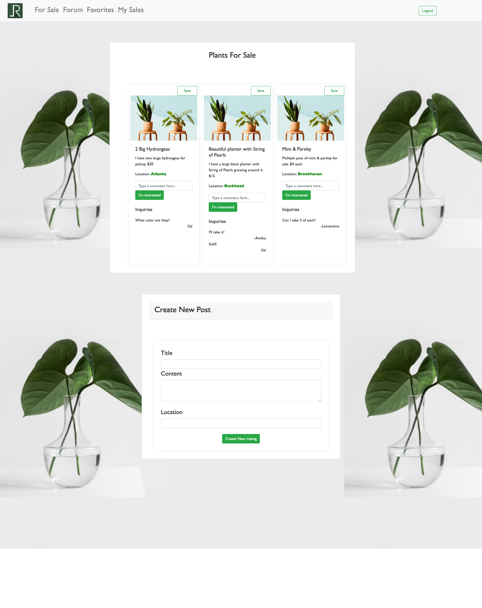
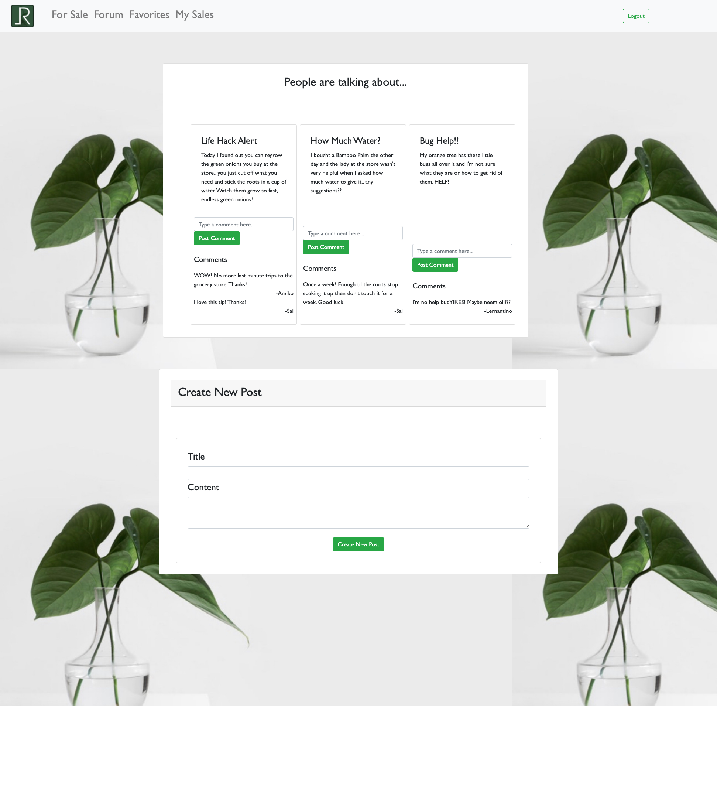
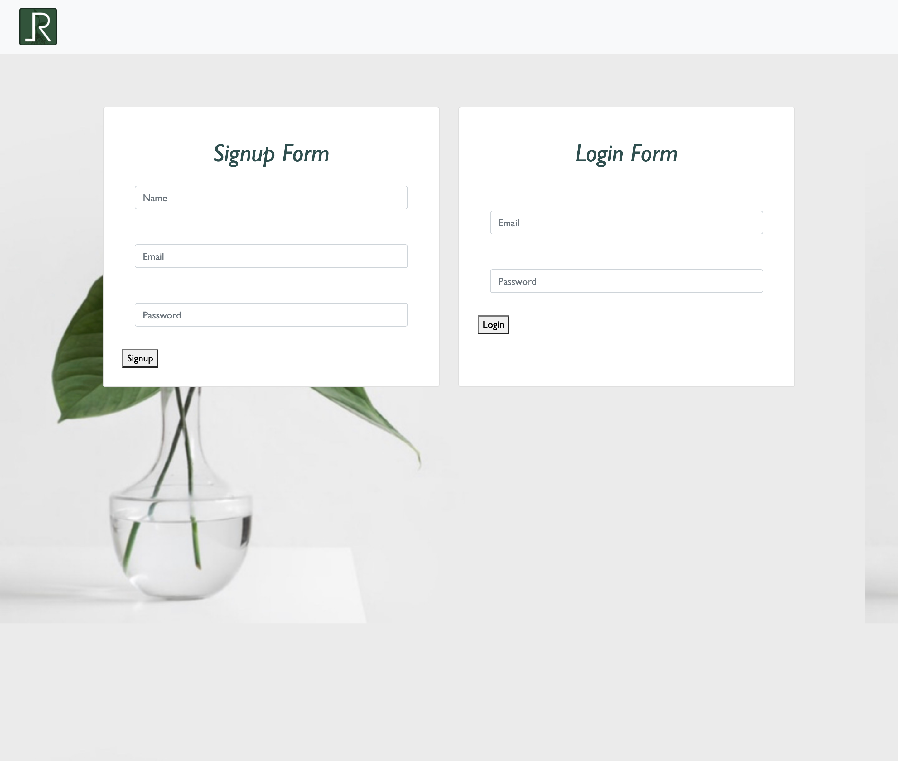

# Local Roots
## Description
Local Roots is an application for plant lovers and gardening enthusiasts where they can sell their extra bulbs and share their favorite techniques. Also allowing you to post plants for sale, view current plants for sale, and have a forum that allows you to ask questions and share opinions. 

## Table of Contents
  * [Project ](#project)
  * [Credits](#credits)
  * [Questions](#questions)
  * [License](#license)

## Deployed Site
The deployed site can be found here: [Local Roots](https://damp-reef-27856.herokuapp.com/)

## Project 

## Check out the contributors on Github

[Matt Hale](https://github.com/matthale11)

[Juliana Scheil](https://github.com/julesscheil)

[Joy Jackson](https://github.com/Joydotcom)

[Benn Santos](https://github.com/bennsantos20)

## Questions 

If you have any questions, feel free to contact and connect with us at:

[Matt Hale](https://www.linkedin.com/in/matthewshale/)

[Juliana Scheil](https://www.linkedin.com/in/juliana-scheil/)

[Joy Jackson](https://www.linkedin.com/in/joysjackson/)

[Benn Santos](https://www.linkedin.com/in/benjamin-santos-0b6635208/)

## License
  